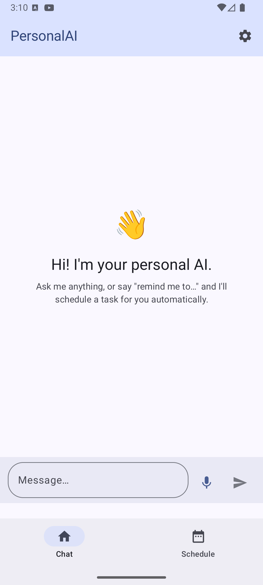
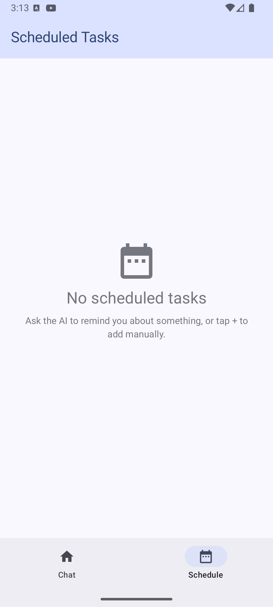
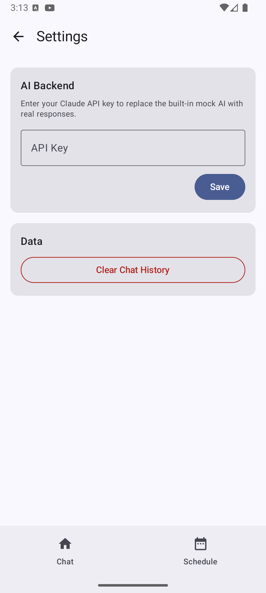
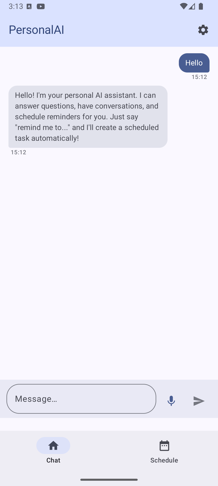

# PersonalAI

> A personal AI assistant for Android — chat, voice input, device integration, task scheduling, persistent memory, and real-time web search.


---

## Screenshots

| Chat | Scheduled Tasks | Settings |
|------|----------------|---------|
|  |  |  |

| Chat Conversation |
|-------------------|
|  |

---

## Features

### 💬 AI Chat
- Natural language conversation with a personal AI assistant
- Message bubbles with timestamps, selectable text, and smooth scroll-to-bottom
- Typing indicator while the AI is responding
- Agent status indicator showing active tool operations
- Pending input card when the AI asks a follow-up question
- Error feedback via Snackbar

### 🎤 Voice Input
- Push-to-talk microphone with visual states: idle, recording (pulsing red), and transcribing
- Powered by Android's built-in speech recognition

### 🔍 Real-Time Web Search
- The AI automatically searches the web when you ask about current events, news, or live data
- Powered by OpenAI's `web_search_preview` tool — no extra API key needed
- Optional: add a Serper API key in Settings for additional search capabilities

### 📅 Smart Task Scheduling
- Ask the AI to set a reminder — it creates and schedules it automatically
  - *"Remind me to call the dentist tomorrow at 10am"*
  - *"Schedule a meeting with John in 2 hours"*
- Tasks appear on the Scheduled Tasks screen with their due time
- Overdue tasks are visually highlighted
- Android notifications fire at the scheduled time (even when the app is in the background)
- Manually add/edit tasks via the ➕ button
- Supports recurrence: one-time, daily, or weekly
- Tasks can output to notification, chat, or both

### 📍 Location-Based Tasks
- Create geofence-triggered reminders and AI prompts tied to real-world locations
- Configure radius (in meters) and trigger on entry, exit, or both
- Tasks fire automatically when your device crosses the geofence boundary

### 🧠 Persistent Memory
- The AI remembers things across conversations
- Save memories naturally:
  - *"Remember that my name is Alex"*
  - *"Remember I prefer concise answers"*
- Retrieve memories: *"What do you remember about me?"*
- Forget specific topics: *"Forget my name"*
- Clear everything: *"Forget everything about me"*

### 📚 Library
- **Memories tab**: Browse, search, copy, or delete stored memories
- **Files tab**: Browse, preview, share, or delete files created by the AI

### 📱 Device Integration Tools
The AI can interact with your Android device directly:

| Tool | Example |
|------|---------|
| Dial phone | *"Call mom"* |
| Send SMS | *"Text John that I'm running late"* |
| Send messages (WhatsApp, etc.) | *"Send a WhatsApp to Sarah"* |
| Add calendar event | *"Add a dentist appointment on Friday at 3pm"* |
| Set alarm | *"Wake me up at 7am tomorrow"* |
| Get current location | *"Where am I?"* |
| Open app | *"Open Spotify"* |
| Read contacts | *"What's Alex's number?"* |
| Read/write/share files | *"Save this recipe to a file"* |
| Battery level | *"What's my battery at?"* |
| Clipboard access | *"What's in my clipboard?"* |
| Web search | *"What's the weather in Tel Aviv?"* |

### ⚡ Quick Assistant Overlay
- Set PersonalAI as your default Android assistant
- Access a quick-chat overlay from any app via a long-press on the Home button
- Open the full chat directly from the overlay

### ⚙️ Settings
- **AI Backend**: Switch between OpenAI (cloud) and Ollama (local)
- **OpenAI**: Enter your API key to use GPT-4o with real-time web search
- **Ollama**: Configure server URL and model name for fully local inference
- **Web Search**: Optionally add a Serper API key
- **Quick Assistant**: Shortcut to set PersonalAI as your default assistant
- **Data**: Clear chat history with one tap

### 🤖 Mock Mode (No API Key Required)
- The app runs with a built-in mock AI when no backend is configured
- Supports scheduling, memory, and common conversational intents
- Useful for testing or offline use

---

## Tech Stack

| Category | Library / Tool |
|----------|---------------|
| Language | Kotlin 2.1.20 |
| UI | Jetpack Compose, Material 3 |
| Architecture | Clean Architecture + MVVM |
| Navigation | Navigation Compose 2.8.5 |
| Dependency Injection | Hilt 2.55 |
| Database | Room 2.6.1 |
| Preferences | DataStore Preferences 1.1.1 |
| Background Work | WorkManager 2.9.1 |
| Location / Geofencing | Google Play Services Location 21.3.0 |
| Networking | OkHttp 4.12.0 |
| AI Backend (cloud) | OpenAI Responses API (GPT-4o + web_search_preview) |
| AI Backend (local) | Ollama (OpenAI-compatible, v0.13.3+) |
| Async | Kotlin Coroutines 1.10.1 |
| Testing | JUnit 4, MockK 1.13.12, Compose UI Test |

---

## Architecture

```
┌──────────────────────────────────────────────────────┐
│                  Presentation Layer                   │
│  ChatScreen · ScheduleScreen · LocationTasksScreen   │
│  LibraryScreen · SettingsScreen · QuickChatActivity  │
│  (Jetpack Compose + ViewModels)                      │
├──────────────────────────────────────────────────────┤
│                    Domain Layer                       │
│   Use Cases · Repository Interfaces                  │
│   Domain Models (Message, Memory, ScheduledTask,     │
│   GeofenceTask)                                      │
├──────────────────────────────────────────────────────┤
│                     Data Layer                        │
│  ┌──────────────────┐  ┌────────────────────────┐   │
│  │ OpenAiDataSource │  │  OllamaDataSource       │   │
│  │ (Responses API)  │  │  (local, OpenAI-compat) │   │
│  └────────┬─────────┘  └──────────┬─────────────┘   │
│           └────────────┬───────────┘                 │
│                AiRepositoryImpl                      │
│   Room DB (messages, tasks, memories, geofences)    │
│   DataStore (API keys, provider config)             │
│   WorkManager (scheduled notifications)             │
│   Geofencing API (location triggers)                │
│   Tool Registry (31 Android integration tools)      │
└──────────────────────────────────────────────────────┘
```

## Project Structure

```
app/src/main/java/com/personal/personalai/
├── data/
│   ├── datasource/ai/
│   │   ├── OpenAiDataSource.kt        # OpenAI Responses API + web search
│   │   ├── OllamaDataSource.kt        # Local Ollama backend
│   │   └── MockAiDataSource.kt        # Offline fallback
│   ├── local/                         # Room entities, DAOs, database (v6)
│   ├── repository/                    # Repository implementations
│   ├── tools/                         # 31 Android tool implementations
│   └── preferences/                   # DataStore (API keys, provider)
├── domain/
│   ├── model/                         # Message, Memory, ScheduledTask, GeofenceTask
│   ├── repository/                    # Repository interfaces
│   └── usecase/                       # Business logic (12+ use cases)
├── presentation/
│   ├── chat/                          # ChatScreen + ChatViewModel
│   ├── schedule/                      # ScheduledTasksScreen + ViewModel
│   ├── location/                      # LocationTasksScreen + ViewModel
│   ├── library/                       # LibraryScreen (Memories + Files tabs)
│   ├── settings/                      # SettingsScreen + ViewModel
│   ├── quickchat/                     # Quick assistant overlay
│   └── navigation/                    # Bottom nav setup
├── di/                                # Hilt modules
├── receiver/                          # BootReceiver, GeofenceBroadcastReceiver
└── worker/                            # WorkManager notification worker
```

---

## How It Works — AI Tool Calling

The AI uses structured tool calls to trigger app actions. The agent loop runs up to 8 iterations, executing tools and injecting results back into the conversation before producing a final response. Tool tags are stripped before the message is displayed to the user.

### Conversation-driven actions

| Tool | Example trigger | Action |
|------|----------------|--------|
| `schedule_task` | *"Remind me to..."* | Creates a scheduled notification |
| `save_memory` | *"Remember that..."* | Saves to Room DB, injected into every future prompt |
| `forget_memory` | *"Forget my name"* | Deletes memories matching the topic |
| `forget_all_memories` | *"Forget everything"* | Clears all stored memories |
| `set_location_task` | *"Alert me when I arrive at work"* | Creates a geofence-triggered task |
| `ask_user` | *(AI needs clarification)* | Surfaces an input card in the chat UI |
| `web_search` | *"What's in the news?"* | Calls Serper API (or OpenAI built-in) |

### Device integration actions

`dial_phone` · `send_sms` · `send_message` · `add_calendar_event` · `set_alarm` · `get_location` · `open_app` · `read_contacts` · `get_battery_level` · `read_clipboard` · `write_clipboard` · `get_installed_apps` · `geocode_address` · `read_file` · `write_file` · `delete_file` · `list_files` · `share_file`

---

## Getting Started

### Prerequisites
- Android Studio Hedgehog (2023.1.1) or newer
- JDK 11+
- Android device or emulator (API 28+)

### 1. Clone the repository

```bash
git clone https://github.com/shaymark/PersonalAI.git
cd PersonalAI
```

### 2. Open in Android Studio

Open the `PersonalAI` folder in Android Studio. Gradle will sync automatically.

### 3. Run the app

```bash
./gradlew installDebug
```

Or press **Run ▶** in Android Studio.

The app launches in **mock mode** — no API key needed to try it out.

### 4. Enable Real AI with OpenAI

1. Get an API key from [platform.openai.com](https://platform.openai.com/api-keys)
2. Open the app → tap ⚙️ **Settings** → paste your key → tap **Save**
3. The app now uses **GPT-4o** with real-time web search

> **Note:** Web search calls use OpenAI's `web_search_preview` tool and are billed to your OpenAI account per the current pricing.

### 5. (Alternative) Use Ollama for Local Inference

1. Install and run [Ollama](https://ollama.com) on your local network (v0.13.3+)
2. Open the app → tap ⚙️ **Settings** → select **Ollama**
3. Enter your server URL (e.g., `http://192.168.1.x:11434`) and model name
4. No API key or internet required

---

## Permissions

| Permission | Purpose |
|-----------|---------|
| `INTERNET` | OpenAI / Ollama API calls |
| `RECORD_AUDIO` | Voice input (speech-to-text) |
| `POST_NOTIFICATIONS` | Task reminder notifications |
| `RECEIVE_BOOT_COMPLETED` | Restore scheduled tasks after device reboot |
| `READ_CONTACTS` | Contact lookup tool |
| `SEND_SMS` | SMS sending tool |
| `ACCESS_FINE_LOCATION` / `ACCESS_BACKGROUND_LOCATION` | Geofence location tasks |

---

## License

```
MIT License

Copyright (c) 2025

Permission is hereby granted, free of charge, to any person obtaining a copy
of this software and associated documentation files (the "Software"), to deal
in the Software without restriction, including without limitation the rights
to use, copy, modify, merge, publish, distribute, sublicense, and/or sell
copies of the Software, and to permit persons to whom the Software is
furnished to do so, subject to the following conditions:

The above copyright notice and this permission notice shall be included in all
copies or substantial portions of the Software.

THE SOFTWARE IS PROVIDED "AS IS", WITHOUT WARRANTY OF ANY KIND, EXPRESS OR
IMPLIED, INCLUDING BUT NOT LIMITED TO THE WARRANTIES OF MERCHANTABILITY,
FITNESS FOR A PARTICULAR PURPOSE AND NONINFRINGEMENT. IN NO EVENT SHALL THE
AUTHORS OR COPYRIGHT HOLDERS BE LIABLE FOR ANY CLAIM, DAMAGES OR OTHER
LIABILITY, WHETHER IN AN ACTION OF CONTRACT, TORT OR OTHERWISE, ARISING FROM,
OUT OF OR IN CONNECTION WITH THE SOFTWARE OR THE USE OR OTHER DEALINGS IN THE
SOFTWARE.
```
